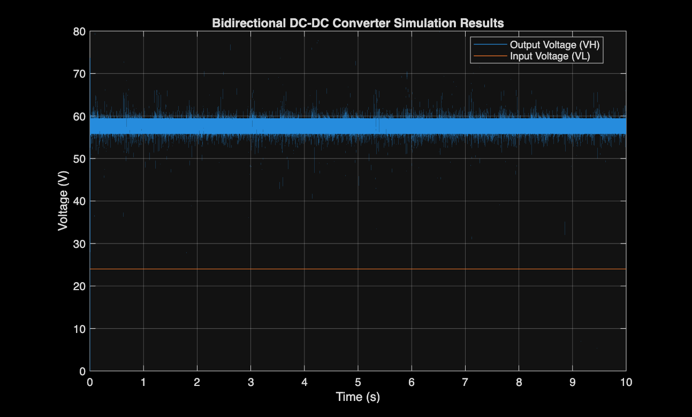

# Bidirectional Buck-Boost Converter (Simulink)

This repository contains a MATLAB Simulink model and generation scripts for a Bidirectional DC-DC Converter.

The topology allows power to flow in both directions:
1. **Boost Mode:** Power flows from the low voltage side to the high voltage side, stepping up the voltage.
2. **Buck Mode:** Power flows from the high voltage side back to the low voltage side, stepping down the voltage.

## Files
- `Bidirectional_DC_DC.slx`: The Simulink model built using Simscape Specialized Power Systems.
- `build_simulink.m`: MATLAB script to programmatically create the Simulink model and place the components.
- `connect_simulink.m`: MATLAB script to programmatically connect the ports of the components.

## Requirements
- MATLAB (tested on R2025a)
- Simulink
- Simscape / Simscape Electrical (Specialized Power Systems)

## Usage
Simply open `Bidirectional_DC_DC.slx` in Simulink. The model is already configured and wired. 
Click **Run** to simulate the model and view the output voltage on the Scope.

## Simulation Results

